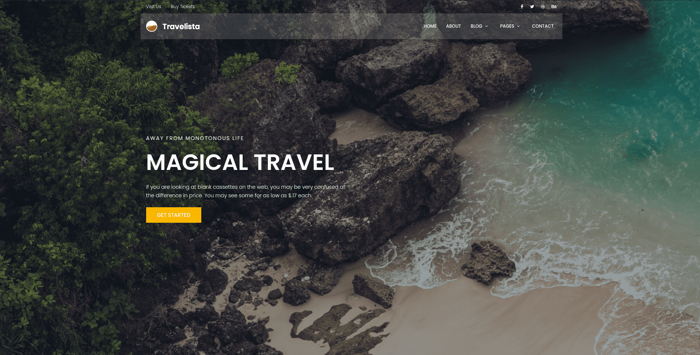

# Travelista

Travelista is my Django 3.2 course project.




## Installation

Use the package manager [pip](https://pip.pypa.io/en/stable/) to install the requirements.\
For development:
```bash
pip install Travelista/requirements/development.txt
```
For production:
```bash
pip install Travelista/requirements/production.txt
```
after installing the requirements you should create a ``.end`` file inside Travelista directory (project root directory) and fill out these values:
```text
SECRET_KEY=
DEBUG=True or False
GOOGLE_CLIENT_PUBLIC=
GOOGLE_CLIENT_SECRET=
RECAPTCHA_PUBLIC_KEY_V2=
RECAPTCHA_PRIVATE_KEY_V2=
RECAPTCHA_PUBLIC_KEY_V3=
RECAPTCHA_PRIVATE_KEY_V3=
SQL_NAME=
SQL_USER=
SQL_PASS=
```

## Usage

Just use it as you would use a Django project.\
Use ``wsgi.py`` or ``asgi.py`` for production or use the ``manage.py`` for development.

## Contributing

Pull requests are welcome. For major changes, please open an issue first
to discuss what you would like to change.

Please make sure to update tests as appropriate.

## License

[MIT](https://choosealicense.com/licenses/mit/)